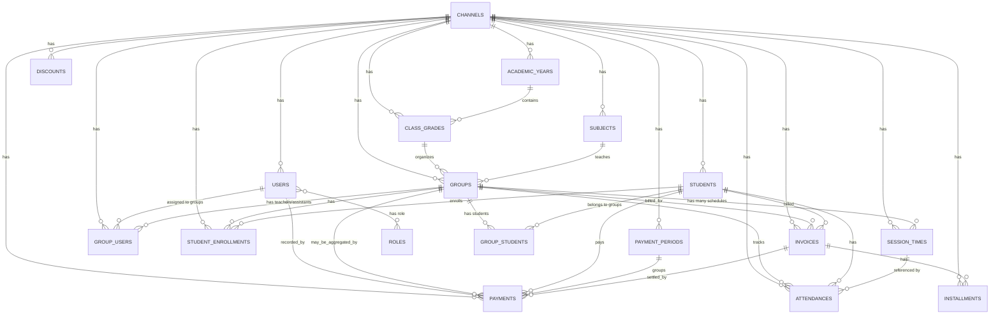

# 📊 Database Schema Documentation
## نظام إدارة الدروس الخصوصية والكورسات - Teachify

**الإصدار**: 2.0  
**تاريخ التحديث**: 2026-01-20  
**الحالة**: ✅ Production Ready

---

## 📋 جدول المحتويات

1. [نظرة عامة](#نظرة-عامة)
2. [ERD Diagram](#erd-diagram)
3. [Business Requirements](#business-requirements)
4. [User Stories](#user-stories)
5. [Database Tables](#database-tables)
6. [Relationships](#relationships)
7. [API Endpoints](#api-endpoints)

---

## 🎯 نظرة عامة

نظام Teachify هو منصة B2B لإدارة الدروس الخصوصية والكورسات في مصر، يدعم:
- ✅ **Multi-tenant** (كل سنتر/أكاديمية = Channel مستقل)
- ✅ **نظام تعليمي مصري** (سنوات دراسية، فصول، مواد)
- ✅ **كورسات عامة** (برمجة، مهارات - بدون سنة دراسية)
- ✅ **باقات شهرية** (عدد حصص محدد لكل طالب)
- ✅ **إدارة المدرسين والمساعدين** (Group له many users)
- ✅ **نظام دفع شامل** (كاش، محافظ، أونلاين)
- ✅ **تتبع الحضور** (مرتبط بأوقات الحصص)

---

## 📐 ERD Diagram

### ERD الكامل



### ERD مبسط (العلاقات الأساسية)

```
CHANNEL (القناة/السنتر)
  ├── ACADEMIC_YEAR (السنة الدراسية) ⚠️ اختياري
  │     └── CLASS_GRADE (الفصل: 3 ثانوي - علمي)
  │           └── GROUP (المجموعة: 3 ثانوي فيزياء)
  │                 ├── SESSION_TIMES (أوقات الحصص: اتنين 6-8 + خميس 4-6) ✅ Multiple
  │                 ├── GROUP_USERS (المدرسين/المساعدين) ✅ Many Users
  │                 ├── GROUP_STUDENTS (الطلاب)
  │                 ├── STUDENT_ENROLLMENTS (الباقات الشهرية)
  │                 ├── ATTENDANCES (الحضور)
  │                 ├── INVOICES (الفواتير)
  │                 └── PAYMENTS (المدفوعات)
  │
  ├── CLASS_GRADE (بدون سنة دراسية) ⚠️ للكورسات العامة
  │     └── GROUP (مثلاً: Python Programming)
  │
  ├── SUBJECT (المادة: فيزياء / Python / ...)
  │     └── GROUP (المجموعات في هذه المادة)
  │
  ├── USER (المستخدم/المدرس/المساعد)
  │     ├── GROUP_USERS (المجموعات اللي هو فيها)
  │     └── PAYMENTS (المدفوعات اللي سجلها)
  │
  ├── STUDENT (الطالب)
  │     ├── STUDENT_ENROLLMENTS (باقاته الشهرية)
  │     ├── ATTENDANCES (حضوره)
  │     ├── INVOICES (فواتيره)
  │     └── PAYMENTS (مدفوعاته)
  │
  └── PAYMENT_PERIOD (فترة التحصيل: يناير 2026)
        └── PAYMENTS (المدفوعات في هذه الفترة)
```

---

## 📋 Business Requirements

### BR1: Multi-tenant Architecture
- كل سنتر/أكاديمية = Channel مستقل
- عزل كامل للبيانات بين Channels
- كل جدول له `channel_id`

### BR2: دعم نوعين من الكورسات
- **نظام تعليمي مصري**: مربوط بـ Academic Year (مثلاً: 3 ثانوي - 2024/2025)
- **كورسات عامة**: بدون Academic Year (مثلاً: Python Beginner)

### BR3: Multiple Session Times per Group
- Group واحد له أوقات حصص متعددة (مثلاً: اتنين 6-8 + خميس 4-6)
- كل Session Time له day, start_time, end_time

### BR4: Group له Many Users
- Group واحد له مدرسين/مساعدين/مساعدين كتير
- كل User له role_type في Group: teacher, assistant, helper, coordinator

### BR5: الباقات الشهرية
- كل طالب له باقة شهرية في Group معين
- الباقة تحدد: عدد الحصص/شهر، السعر، حالة الاشتراك
- تتبع الحصص المستخدمة/المتبقية

### BR6: نظام الدفع
- دعم طرق دفع مصرية: كاش، محافظ (Vodafone/Orange/Etisalat/Easy Pay)، تحويل بنكي
- فترات تحصيل (Payment Periods)
- فواتير وأقساط
- خصومات

### BR7: تتبع الحضور
- حضور/غياب مرتبط بـ Session Time + Date
- ربط مع الباقات الشهرية (تحديث used_sessions_count)

---

## 👥 User Stories

### US1: إنشاء مجموعة جديدة
**كـ أدمن**، أريد أن أنشئ مجموعة جديدة (3 ثانوي فيزياء) مع:
- تحديد المادة والفصل
- إضافة أوقات حصص متعددة (اتنين 6-8 + خميس 4-6)
- تعيين مدرسين ومساعدين
- تحديد السعر الشهري

### US2: تسجيل طالب في باقة شهرية
**كـ محاسب**، أريد أن أسجل طالب في باقة شهرية:
- اختيار Group
- تحديد عدد الحصص/شهر (مثلاً: 8 حصص)
- تحديد السعر المتفق عليه
- تفعيل الاشتراك

### US3: تعيين مدرسين/مساعدين لمجموعة
**كـ أدمن**، أريد أن أعيّن:
- مدرس رئيسي (teacher)
- مساعد (assistant)
- مساعد إضافي (helper)

للمجموعة الواحدة.

### US4: تسجيل حضور طالب
**كـ مدرس**، أريد أن أسجل حضور/غياب طالب في حصة معينة:
- اختيار Group + Session Time + Date
- تحديث عدد الحصص المستخدمة في الباقة تلقائياً

### US5: تحصيل دفعة شهرية
**كـ محاسب**، أريد أن أسجل دفع شهري:
- ربط بـ Payment Period (يناير 2026)
- ربط بـ Student Enrollment (الباقة)
- تحديث حالة الدفع

### US6: عرض تقرير المجموعة
**كـ مدرس/أدمن**، أريد أن أشوف:
- قائمة الطلاب في المجموعة
- قائمة المدرسين/المساعدين
- إحصائيات الحضور
- إحصائيات المدفوعات

---

## 🗄️ Database Tables

### Core Tables

#### `channels`
- `id`, `name`, `type`, `settings` (JSON), `created_at`, `updated_at`

#### `users`
- `id`, `name`, `email`, `phone`, `gender`, `password`, `status`, `image`, `role_id`, `channel_id`, `created_at`, `updated_at`

#### `roles`
- `id`, `name`, `guard_name`, `channel_id`, `created_at`, `updated_at`

### Academic Tables

#### `academic_years`
- `id`, `name`, `start_year`, `end_year`, `is_active`, `channel_id`, `created_at`, `updated_at`

#### `class_grades`
- `id`, `grade_level` (nullable), `stage` (nullable), `name` (nullable), `academic_year_id` (nullable), `is_active`, `channel_id`, `created_at`, `updated_at`

#### `subjects`
- `id`, `code`, `credits`, `is_active`, `channel_id`, `created_at`, `updated_at`

#### `groups`
- `id`, `name`, `code`, `class_grade_id`, `subject_id`, `capacity`, `price`, `is_active`, `channel_id`, `created_at`, `updated_at`

#### `session_times`
- `id`, `day`, `start_time`, `end_time`, `group_id`, `is_active`, `channel_id`, `created_at`, `updated_at`

#### `group_users` ✅ **جديد**
- `id`, `channel_id`, `group_id`, `user_id`, `role_type` (teacher/assistant/helper/coordinator), `status`, `joined_at`, `notes`, `created_at`, `updated_at`

#### `students`
- `id`, `code`, `name`, `email`, `phone`, `gender`, `password`, `status`, `image`, `channel_id`, `created_at`, `updated_at`

#### `group_students` (pivot)
- `group_id`, `student_id`, `created_at`, `updated_at`

#### `student_enrollments` ✅ **جديد**
- `id`, `channel_id`, `student_id`, `group_id`, `enrollment_type` (monthly/course/session_package), `status` (active/paused/canceled/completed), `start_date`, `end_date`, `agreed_monthly_fee`, `agreed_course_fee`, `agreed_session_fee`, `sessions_per_month`, `used_sessions_count`, `remaining_sessions_count`, `notes`, `created_at`, `updated_at`

### Attendance Tables

#### `attendances`
- `id`, `student_id`, `group_id`, `session_time_id` (nullable), `date`, `status` (present/absent/late/excused), `notes`, `channel_id`, `created_at`, `updated_at`

### Payment Tables

#### `payment_periods`
- `id`, `name`, `period_type` (monthly/weekly/daily/session/custom), `start_date`, `end_date`, `month`, `year`, `is_open`, `is_active`, `notes`, `channel_id`, `created_at`, `updated_at`

#### `invoices`
- `id`, `invoice_number`, `student_id`, `group_id`, `total_amount`, `discount_amount`, `final_amount`, `paid_amount`, `remaining_amount`, `due_date`, `issue_date`, `status`, `notes`, `channel_id`, `created_at`, `updated_at`

#### `payments`
- `id`, `student_id`, `group_id`, `payment_period_id`, `invoice_id`, `installment_id`, `amount`, `discount_amount`, `final_amount`, `payment_date`, `payment_method`, `status`, `reference_number`, `transaction_id`, `notes`, `paid_by` (user_id), `channel_id`, `created_at`, `updated_at`

#### `installments`
- `id`, `invoice_id`, `installment_number`, `amount`, `due_date`, `paid_date`, `status`, `notes`, `channel_id`, `created_at`, `updated_at`

#### `discounts`
- `id`, `code`, `name`, `description`, `type` (percentage/fixed), `value`, `min_amount`, `max_discount`, `start_date`, `end_date`, `usage_limit`, `used_count`, `is_active`, `applies_to`, `channel_id`, `created_at`, `updated_at`

---

## 🔗 Relationships

### Group Relationships
- `belongsTo` → ClassGrade, Subject, Channel
- `hasMany` → SessionTimes, GroupUsers, StudentEnrollments, Attendances
- `belongsToMany` → Students (via group_students), Users (via group_users)

### User Relationships
- `belongsTo` → Channel, Role
- `belongsToMany` → Groups (via group_users)
- `hasMany` → Payments (as recorder)

### Student Relationships
- `belongsTo` → Channel
- `belongsToMany` → Groups (via group_students)
- `hasMany` → StudentEnrollments, Attendances, Invoices, Payments

### StudentEnrollment Relationships
- `belongsTo` → Student, Group, Channel

### GroupUser Relationships
- `belongsTo` → Group, User, Channel

---

## 🔌 API Endpoints

### Groups
- `GET /api/v1/groups` - List groups
- `GET /api/v1/groups/{id}` - Get group details
- `POST /api/v1/groups` - Create group
- `PUT /api/v1/groups/{id}` - Update group
- `DELETE /api/v1/groups/{id}` - Delete group

### Group Users
- `GET /api/v1/groups/{groupId}/users` - Get group users (teachers/assistants)
- `POST /api/v1/groups/{groupId}/users` - Assign user to group
- `PUT /api/v1/groups/{groupId}/users/{userId}` - Update user role in group
- `DELETE /api/v1/groups/{groupId}/users/{userId}` - Remove user from group

### Student Enrollments
- `GET /api/v1/student-enrollments` - List enrollments
- `GET /api/v1/student-enrollments/{id}` - Get enrollment details
- `POST /api/v1/student-enrollments` - Create enrollment
- `PUT /api/v1/student-enrollments/{id}` - Update enrollment
- `DELETE /api/v1/student-enrollments/{id}` - Cancel enrollment
- `GET /api/v1/students/{studentId}/enrollments` - Get student enrollments
- `GET /api/v1/groups/{groupId}/enrollments` - Get group enrollments

### Payments
- `GET /api/v1/payments` - List payments
- `POST /api/v1/payments` - Create payment
- `GET /api/v1/payments/statistics` - Get statistics

### Attendances
- `GET /api/v1/attendances` - List attendances
- `POST /api/v1/attendances` - Record attendance
- `PUT /api/v1/attendances/{id}` - Update attendance

---

## 📝 ملاحظات مهمة

1. **Academic Year اختياري**: `class_grades.academic_year_id` nullable لدعم الكورسات العامة
2. **Multiple Session Times**: Group واحد له `session_times` متعددة
3. **Many Users per Group**: Group واحد له `group_users` متعددة (teachers, assistants, helpers)
4. **Monthly Packages**: كل طالب له `student_enrollment` مع عدد حصص محدد
5. **Channel Scoping**: كل جدول له `channel_id` للعزل

---

**آخر تحديث**: 2026-01-20  
**المسؤول عن التوثيق**: Development Team

