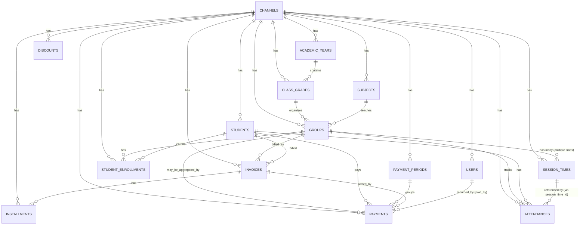

# 📊 Database Design - Payment Module Phase 1
## نظام إدارة المدفوعات للدروس الخصوصية والكورسات في مصر

---

## 🎯 نظرة عامة (Overview)

هذا التصميم يغطي **Phase 1** من النظام: إدارة المدفوعات للسنترات والأكاديميات مع دعم:
- ✅ **Multiple Session Times per Group** (أوقات مختلفة للحصص في نفس المجموعة)
- ⚠️ **Academic Year Integration** (اختياري - ربط الفصول بالسنة الدراسية للنظام التعليمي فقط)
- ✅ **Support General Courses** (دعم الكورسات العامة مثل البرمجة بدون سنة دراسية)
- ✅ **Subjects & Users & Roles** (المواد الدراسية والمستخدمين والأدوار)
- ✅ **Cash Monthly Payments** (الدفع الشهري الكاش - الحالة الحالية)
- ✅ **Scalable for Future** (جاهز للتوسع لـ Marketplace/Online Payments)

---

## 📐 ERD Diagram (Entity Relationship Diagram)

### ERD الكامل



### ERD مبسط (العلاقات الأساسية)

```
CHANNEL (القناة/السنتر)
  ├── ACADEMIC_YEAR (السنة الدراسية) ⚠️ اختياري
  │     └── CLASS_GRADE (الفصل: 3 ثانوي - علمي)
  │           └── GROUP (المجموعة: 3 ثانوي فيزياء - مجموعة 6 مساء)
  │                 ├── SESSION_TIMES (أوقات الحصص: اتنين 6-8 + خميس 4-6) ✅ Multiple
  │                 ├── STUDENT_ENROLLMENTS (اشتراكات الطلاب)
  │                 ├── ATTENDANCES (الحضور - مربوط بـ session_time_id)
  │                 ├── INVOICES (الفواتير)
  │                 └── PAYMENTS (المدفوعات)
  │
  ├── CLASS_GRADE (بدون سنة دراسية) ⚠️ للكورسات العامة
  │     └── GROUP (مثلاً: Python Programming - Beginner)
  │
  ├── SUBJECT (المادة: فيزياء / Python / ...)
  │     └── GROUP (المجموعات في هذه المادة)
  │
  ├── STUDENT (الطالب)
  │     ├── STUDENT_ENROLLMENTS (اشتراكاته في المجموعات)
  │     ├── ATTENDANCES (حضوره)
  │     ├── INVOICES (فواتيره)
  │     └── PAYMENTS (مدفوعاته)
  │
  ├── PAYMENT_PERIOD (فترة التحصيل: يناير 2026)
  │     └── PAYMENTS (المدفوعات في هذه الفترة)
  │
  └── USER (المستخدم/الموظف)
        └── PAYMENTS (المدفوعات اللي سجلها)
```

**ملاحظات مهمة**:
- ✅ **Group له Multiple Session Times**: Group واحد (مثلاً: 3 ثانوي فيزياء) له `session_times` متعددة (اتنين 6-8 + خميس 4-6)
- ⚠️ **Academic Year اختياري**: 
  - **نظام تعليمي مصري** (مدارس/سنترات): `class_grades` مربوط بـ `academic_year_id` (مثلاً: 3 ثانوي - 2024/2025)
  - **كورسات عامة** (برمجة/مهارات): `class_grades` **بدون** `academic_year_id` (مثلاً: Python Beginner - بدون سنة دراسية)
- ✅ **Attendance مربوط بـ SessionTime**: الحضور مربوط بـ `session_time_id` + `date` عشان نعرف أي حصة بالضبط

---

## 📋 شرح الجداول الأساسية (Detailed Table Descriptions)

### 1. **CHANNELS** (القنوات/السنترات/الأكاديميات)

**الغرض**: يمثل كل سنتر/أكاديمية/مزود خدمة مستقل في النظام.

**الحقول الأساسية**:
- `id` (PK)
- `name` (اسم السنتر)
- `type` (center | academy | instructor_group) - اختياري للمستقبل
- `settings` (JSON) - سياسات مخصصة لكل قناة
- `created_at`, `updated_at`

**العلاقات**:
- `hasMany` → Users, Students, Groups, AcademicYears, Subjects, Payments, Invoices...

---

### 2. **ACADEMIC_YEARS** (السنوات الدراسية)

**الغرض**: يمثل السنة الدراسية (مثلاً: 2024/2025).

**الحقول** (موجودة فعليًا):
- `id` (PK)
- `channel_id` (FK → channels)
- `name` (string, nullable) - "2024/2025"
- `start_year` (year) - 2024
- `end_year` (year) - 2025
- `is_active` (boolean) - السنة الحالية
- `created_at`, `updated_at`

**العلاقات**:
- `belongsTo` → Channel
- `hasMany` → ClassGrades

**مثال**:
```
id: 1
name: "2024/2025"
start_year: 2024
end_year: 2025
is_active: true
channel_id: 1
```

---

### 3. **CLASS_GRADES** (الفصول الدراسية)

**الغرض**: يمثل الفصل الدراسي (مثلاً: 3 ثانوي - علمي) أو مستوى كورس (مثلاً: Python Beginner).

**الحقول** (موجودة فعليًا - **محتاج تعديل**):
- `id` (PK)
- `channel_id` (FK → channels)
- `academic_year_id` (FK → academic_years, **nullable**) ⚠️ **اختياري**
- `grade_level` (tinyint, nullable) - 1 → 12 (للنظام التعليمي)
- `stage` (enum, nullable) - 'primary' | 'preparatory' | 'secondary' (للنظام التعليمي)
- `name` (string, nullable) - اسم مخصص للكورسات العامة (مثلاً: "Python Beginner")
- `is_active` (boolean)
- `created_at`, `updated_at`

**العلاقات**:
- `belongsTo` → Channel
- `belongsTo` → AcademicYear (nullable) ⚠️ **اختياري**
- `hasMany` → Groups

**حالتان للاستخدام**:

**1. نظام تعليمي مصري** (مدارس/سنترات):
```
id: 1
grade_level: 12
stage: "secondary"
academic_year_id: 1  ✅ مربوط بسنة دراسية
channel_id: 1
```

**2. كورسات عامة** (برمجة/مهارات):
```
id: 2
name: "Python Programming - Beginner"
grade_level: null  ⚠️ بدون
stage: null  ⚠️ بدون
academic_year_id: null  ⚠️ بدون سنة دراسية
channel_id: 1
```

**ملاحظة مهمة**: 
- لو `academic_year_id` موجود → النظام التعليمي المصري
- لو `academic_year_id` null → كورسات عامة/مهارات

**ملاحظة مهمة**: 
- الـ `class_grades` = الفصل الدراسي (Class)
- الـ `groups` = المجموعة/الكلاس الفعلي (Group) اللي فيه طلاب ومدرس

---

### 4. **SUBJECTS** (المواد الدراسية)

**الغرض**: يمثل المادة الدراسية (مثلاً: فيزياء، رياضيات).

**الحقول** (موجودة فعليًا):
- `id` (PK)
- `channel_id` (FK → channels, nullable)
- `code` (string) - كود المادة
- `credits` (integer, default: 0)
- `is_active` (boolean)
- `created_at`, `updated_at`

**العلاقات**:
- `belongsTo` → Channel (nullable - ممكن تكون عامة)
- `hasMany` → Groups
- `hasMany` → SubjectTranslations (للترجمة)

**مثال**:
```
id: 1
code: "PHY-12"
channel_id: 1
credits: 3
```

---

### 5. **GROUPS** (المجموعات/الكلاسات)

**الغرض**: يمثل مجموعة/كلاس فعلي داخل قناة (مثلاً: 3 ثانوي فيزياء - مجموعة 6 مساء).

**الحقول** (موجودة فعليًا):
- `id` (PK)
- `channel_id` (FK → channels)
- `class_grade_id` (FK → class_grades) ✅ **مربوط بالفصل**
- `subject_id` (FK → subjects) ✅ **مربوط بالمادة**
- `name` (string) - "3 ثانوي فيزياء - مجموعة 6 مساء"
- `code` (string, unique) - كود المجموعة
- `capacity` (tinyint, default: 30) - السعة القصوى
- `price` (decimal 8,2, nullable) - السعر الافتراضي
- `is_active` (boolean)
- `created_at`, `updated_at`

**العلاقات**:
- `belongsTo` → Channel, ClassGrade, Subject
- `hasMany` → SessionTimes ✅ **مجموعة واحدة لها أوقات حصص متعددة**
- `belongsToMany` → Students (via `group_students` pivot table)
- `hasMany` → StudentEnrollments
- `hasMany` → Attendances
- `hasMany` → Invoices
- `hasMany` → Payments

**مثال**:
```
id: 1
name: "3 ثانوي فيزياء - مجموعة 6 مساء"
code: "GRP-PHY-12-001"
class_grade_id: 1
subject_id: 1
capacity: 25
price: 500.00
channel_id: 1
```

**ملاحظة مهمة**: 
- الـ Group **واحد** ممكن يكون له **أوقات حصص مختلفة** (مثلاً: اتنين 6-8 مساء + خميس 4-6 مساء)
- ده بيتم عبر جدول `session_times` (انظر أدناه)

---

### 6. **SESSION_TIMES** (أوقات الحصص)

**الغرض**: يمثل **الجدول الزمني** للحصص في مجموعة معينة (Template/Schedule).

**الحقول** (موجودة فعليًا):
- `id` (PK)
- `channel_id` (FK → channels)
- `group_id` (FK → groups) ✅ **مجموعة واحدة لها أوقات متعددة**
- `day` (enum) - 'saturday' | 'sunday' | 'monday' | 'tuesday' | 'wednesday' | 'thursday' | 'friday'
- `start_time` (time) - "18:00:00"
- `end_time` (time) - "20:00:00"
- `is_active` (boolean)
- `created_at`, `updated_at`

**العلاقات**:
- `belongsTo` → Channel, Group
- `hasMany` → Attendances (referenced via `session_time_id`)

**مثال** (مجموعة واحدة لها حصتين في الأسبوع):
```
Group ID: 1
SessionTime 1:
  day: "monday"
  start_time: "18:00:00"
  end_time: "20:00:00"

SessionTime 2:
  day: "thursday"
  start_time: "16:00:00"
  end_time: "18:00:00"
```

**ملاحظة مهمة**:
- `session_times` = **الجدول الزمني** (متى الحصة؟)
- `attendances` = **الحضور الفعلي** في تاريخ معين (متى حضر الطالب؟)
- في المستقبل ممكن نحتاج `class_sessions` (الحصص الفعلية) لكن دلوقتي `attendances` بتستخدم `date` + `session_time_id` مباشرة

---

### 7. **STUDENTS** (الطلاب)

**الغرض**: يمثل الطالب داخل قناة معينة.

**الحقول** (موجودة في Student module):
- `id` (PK)
- `channel_id` (FK → channels)
- `name` (string)
- `code` (string) - كود الطالب في السنتر
- `phone`, `guardian_phone` (nullable)
- `status` (enum) - 'active' | 'inactive' | 'banned'
- `created_at`, `updated_at`

**العلاقات**:
- `belongsTo` → Channel
- `belongsToMany` → Groups (via `group_students`)
- `hasMany` → StudentEnrollments
- `hasMany` → Attendances
- `hasMany` → Invoices
- `hasMany` → Payments

---

### 8. **STUDENT_ENROLLMENTS** (الاشتراكات)

**الغرض**: يمثل اشتراك طالب في مجموعة معينة (مع معلومات التسعير المتفق عليها).

**الحقول المقترحة** (قد تحتاج migration جديدة):
- `id` (PK)
- `channel_id` (FK → channels)
- `student_id` (FK → students)
- `group_id` (FK → groups)
- `enrollment_type` (enum) - 'monthly' | 'course' | 'session_package'
- `status` (enum) - 'active' | 'paused' | 'canceled' | 'completed'
- `start_date` (date)
- `end_date` (date, nullable)
- `agreed_monthly_fee` (decimal 10,2, nullable) - السعر المتفق عليه
- `agreed_course_fee` (decimal 10,2, nullable)
- `notes` (text, nullable)
- `created_at`, `updated_at`

**العلاقات**:
- `belongsTo` → Channel, Student, Group

**مثال**:
```
student_id: 1
group_id: 1
enrollment_type: "monthly"
agreed_monthly_fee: 500.00
start_date: "2026-01-01"
status: "active"
```

---

### 9. **ATTENDANCES** (الحضور والغياب)

**الغرض**: يمثل حضور/غياب طالب في حصة معينة في تاريخ محدد.

**الحقول** (موجودة فعليًا):
- `id` (PK)
- `channel_id` (FK → channels)
- `student_id` (FK → students)
- `group_id` (FK → groups)
- `session_time_id` (FK → session_times, nullable) ✅ **مرجع لوقت الحصة**
- `date` (date) - تاريخ الحصة الفعلية
- `status` (enum) - 'present' | 'absent' | 'late' | 'excused'
- `notes` (text, nullable)
- `created_at`, `updated_at`

**العلاقات**:
- `belongsTo` → Channel, Student, Group, SessionTime

**مثال**:
```
student_id: 1
group_id: 1
session_time_id: 1 (Monday 18:00-20:00)
date: "2026-01-15"
status: "present"
```

**ملاحظة**: 
- الـ `date` = تاريخ الحصة الفعلية (مثلاً: 15 يناير)
- الـ `session_time_id` = وقت الحصة من الجدول (مثلاً: اتنين 6-8 مساء)

---

### 10. **PAYMENT_PERIODS** (فترات التحصيل)

**الغرض**: يمثل فترة تحصيل (شهر/أسبوع/فترة مخصصة) على مستوى القناة.

**الحقول** (موجودة فعليًا في Payment module):
- `id` (PK)
- `channel_id` (FK → channels)
- `name` (string) - "January 2026"
- `period_type` (enum) - 'monthly' | 'weekly' | 'daily' | 'session' | 'custom'
- `start_date` (date)
- `end_date` (date)
- `month` (integer, nullable)
- `year` (integer, nullable)
- `is_open` (boolean) - مفتوح للتحصيل
- `is_active` (boolean)
- `notes` (text, nullable)
- `created_at`, `updated_at`

**العلاقات**:
- `belongsTo` → Channel
- `hasMany` → Payments

**مثال**:
```
name: "January 2026"
period_type: "monthly"
start_date: "2026-01-01"
end_date: "2026-01-31"
month: 1
year: 2026
is_open: true
```

---

### 11. **INVOICES** (الفواتير)

**الغرض**: يمثل مطالبة رسمية على طالب (فاتورة).

**الحقول** (موجودة فعليًا في Payment module):
- `id` (PK)
- `channel_id` (FK → channels)
- `invoice_number` (string, unique) - "INV-1-202601-0001"
- `student_id` (FK → students)
- `group_id` (FK → groups, nullable)
- `total_amount` (decimal 10,2)
- `discount_amount` (decimal 10,2, default: 0)
- `final_amount` (decimal 10,2)
- `paid_amount` (decimal 10,2, default: 0)
- `remaining_amount` (decimal 10,2)
- `due_date` (date)
- `issue_date` (date)
- `status` (enum) - 'pending' | 'paid' | 'overdue' | 'cancelled'
- `notes` (text, nullable)
- `created_at`, `updated_at`

**العلاقات**:
- `belongsTo` → Channel, Student, Group
- `hasMany` → Installments
- `hasMany` → Payments

**مثال**:
```
invoice_number: "INV-1-202601-0001"
student_id: 1
group_id: 1
total_amount: 500.00
final_amount: 500.00
due_date: "2026-01-31"
status: "pending"
```

---

### 12. **INSTALLMENTS** (الأقساط)

**الغرض**: يمثل قسط من فاتورة (في حالة الدفع على أقساط).

**الحقول** (موجودة فعليًا في Payment module):
- `id` (PK)
- `channel_id` (FK → channels)
- `invoice_id` (FK → invoices)
- `installment_number` (integer) - 1, 2, 3...
- `amount` (decimal 10,2)
- `due_date` (date)
- `paid_date` (date, nullable)
- `status` (enum) - 'pending' | 'paid' | 'overdue' | 'cancelled'
- `notes` (text, nullable)
- `created_at`, `updated_at`

**العلاقات**:
- `belongsTo` → Channel, Invoice
- `hasMany` → Payments

---

### 13. **PAYMENTS** (المدفوعات)

**الغرض**: يمثل عملية دفع واحدة (transaction) من طالب لقناة.

**الحقول** (موجودة فعليًا في Payment module):
- `id` (PK)
- `channel_id` (FK → channels)
- `student_id` (FK → students)
- `group_id` (FK → groups, nullable)
- `payment_period_id` (FK → payment_periods, nullable)
- `invoice_id` (FK → invoices, nullable)
- `installment_id` (FK → installments, nullable)
- `amount` (decimal 10,2)
- `discount_amount` (decimal 10,2, default: 0)
- `final_amount` (decimal 10,2)
- `payment_date` (datetime)
- `payment_method` (enum) - 'cash' | 'bank_transfer' | 'vodafone_cash' | 'orange_money' | 'etisalat_cash' | 'easy_pay' | 'credit_card' | 'debit_card' | 'online' | 'other'
- `status` (enum) - 'pending' | 'completed' | 'failed' | 'refunded' | 'cancelled'
- `reference_number` (string, nullable)
- `transaction_id` (string, nullable)
- `notes` (text, nullable)
- `paid_by` (FK → users, nullable) - الموظف اللي سجل الدفع
- `created_at`, `updated_at`

**العلاقات**:
- `belongsTo` → Channel, Student, Group, PaymentPeriod, Invoice, Installment, User (recorder)

**مثال (Phase 1 - كاش شهري)**:
```
student_id: 1
group_id: 1
payment_period_id: 1 (January 2026)
amount: 500.00
payment_method: "cash"
status: "completed"
paid_by: 5 (User ID)
payment_date: "2026-01-15 10:30:00"
```

---

### 14. **DISCOUNTS** (الخصومات)

**الغرض**: يمثل كود خصم أو عرض ترويجي.

**الحقول** (موجودة فعليًا في Payment module):
- `id` (PK)
- `channel_id` (FK → channels, nullable)
- `code` (string, unique)
- `name` (string)
- `description` (text, nullable)
- `type` (enum) - 'percentage' | 'fixed'
- `value` (decimal 10,2)
- `min_amount` (decimal 10,2, nullable)
- `max_discount` (decimal 10,2, nullable)
- `start_date` (date, nullable)
- `end_date` (date, nullable)
- `usage_limit` (integer, nullable)
- `used_count` (integer, default: 0)
- `is_active` (boolean)
- `applies_to` (enum) - 'all' | 'groups' | 'students'
- `created_at`, `updated_at`

---

### 15. **USERS** (المستخدمون)

**الغرض**: يمثل المستخدمين في النظام (موظفين، مدرسين، أدمن...).

**الحقول** (موجودة في Channel/Core module):
- `id` (PK)
- `channel_id` (FK → channels)
- `name` (string)
- `email` (string, unique)
- `password` (string)
- `role_id` (FK → roles, nullable)
- `created_at`, `updated_at`

**العلاقات**:
- `belongsTo` → Channel, Role
- `hasMany` → Payments (as recorder)

---

### 16. **ROLES** (الأدوار)

**الغرض**: يمثل الأدوار في النظام (admin, teacher, accountant...).

**الحقول** (موجودة في Channel/Core module):
- `id` (PK)
- `name` (string)
- `guard_name` (string)
- `created_at`, `updated_at`

---

## 🔄 تدفق العمل (Business Flow) - Phase 1

### سيناريو: تحصيل كاش شهري لطالب في مجموعة

**الخطوات**:

1. **إعداد البيانات الأساسية**:
   - إنشاء/تأكيد `academic_year` (2024/2025)
   - إنشاء `class_grade` (3 ثانوي - علمي) مربوط بـ `academic_year_id`
   - إنشاء `subject` (فيزياء)
   - إنشاء `group` مربوط بـ `class_grade_id` و `subject_id`
   - إضافة `session_times` للـ group (مثلاً: اتنين 6-8 مساء + خميس 4-6 مساء)

2. **تسجيل الطالب**:
   - إنشاء `student` في القناة
   - إنشاء `student_enrollment` (اشتراك الطالب في المجموعة)

3. **إنشاء فترة تحصيل**:
   - إنشاء `payment_period` (يناير 2026) عبر API: `POST /api/v1/payment-periods/monthly`

4. **إنشاء فاتورة (اختياري)**:
   - إنشاء `invoice` للطالب عن شهر يناير
   - أو تسجيل الدفع مباشرة بدون فاتورة

5. **تسجيل الدفع**:
   - إنشاء `payment`:
     - `student_id`, `group_id`
     - `payment_period_id` = يناير
     - `invoice_id` (لو استخدمت فاتورة)
     - `amount=500`, `payment_method='cash'`, `status='completed'`
     - `paid_by` = User الموظف

6. **تحديث الفاتورة (لو موجودة)**:
   - تحديث `invoice.paid_amount` و `remaining_amount`
   - تحديث `invoice.status` إلى `paid` لو اكتمل الدفع

---

## 📊 تقارير Phase 1

### 1. إجمالي التحصيل لشهر معين
```sql
SELECT 
    SUM(final_amount) as total_revenue,
    COUNT(*) as total_payments
FROM payments
WHERE payment_period_id = ? 
  AND status = 'completed'
  AND channel_id = ?
```

### 2. تحصيل كل مجموعة في شهر
```sql
SELECT 
    g.name as group_name,
    SUM(p.final_amount) as total,
    COUNT(p.id) as payment_count
FROM payments p
JOIN groups g ON p.group_id = g.id
WHERE p.payment_period_id = ?
  AND p.status = 'completed'
  AND p.channel_id = ?
GROUP BY g.id, g.name
```

### 3. كشف حساب طالب
```sql
SELECT 
    p.*,
    pp.name as period_name,
    g.name as group_name
FROM payments p
LEFT JOIN payment_periods pp ON p.payment_period_id = pp.id
LEFT JOIN groups g ON p.group_id = g.id
WHERE p.student_id = ?
  AND p.channel_id = ?
ORDER BY p.payment_date DESC
```

---

## 🚀 الاستعداد للمستقبل (Scalability)

### التصميم الحالي يدعم:

1. **Multiple Session Times per Group** ✅
   - Group واحد له `session_times` متعددة
   - Attendance مربوط بـ `session_time_id` + `date`

2. **Academic Year Integration** ✅
   - `class_grades` مربوط بـ `academic_year_id`
   - المدرس/الأدمن يقدر يفلتر حسب السنة الدراسية

3. **Subjects & Users & Roles** ✅
   - `subjects` موجودة ومربوطة بـ `groups`
   - `users` و `roles` موجودة في النظام

4. **Payment Methods** ✅
   - `payment_method` enum يدعم كل الطرق المصرية
   - جاهز لإضافة Paymob/Fawry (فقط نحتاج `payment_intents` table)

5. **Multi-tenant** ✅
   - كل جدول له `channel_id`
   - عزل كامل للبيانات

### التوسعات المستقبلية (Phase 2+):

1. **Online Payments**:
   - إضافة `payment_intents`, `payment_attempts` tables
   - Webhook handlers لـ Paymob/Fawry

2. **Tutor Wallets & Commissions**:
   - إضافة `tutors`, `tutor_assignments` tables
   - إضافة `ledger_accounts`, `ledger_entries` tables
   - إضافة `payouts` table

3. **Session-based Payments**:
   - إضافة `class_sessions` table (الحصص الفعلية)
   - ربط `payments` بـ `class_session_id`

4. **Packages & Subscriptions**:
   - إضافة `packages`, `package_items` tables
   - ربط `payments` بـ `package_id`

---

## 📊 جدول المقارنة: الموجود vs المطلوب

| الجدول | الحالة | ملاحظات |
|--------|--------|---------|
| `channels` | ✅ موجود | في Channel module |
| `users` | ✅ موجود | في Channel/Core module |
| `roles` | ✅ موجود | في Channel/Core module |
| `academic_years` | ✅ موجود | في Academic module |
| `class_grades` | ✅ موجود | في Academic module، مربوط بـ `academic_year_id` |
| `subjects` | ✅ موجود | في Academic module |
| `groups` | ✅ موجود | في Academic module، مربوط بـ `class_grade_id` و `subject_id` |
| `session_times` | ✅ موجود | في Academic module، Group له multiple session times |
| `students` | ✅ موجود | في Student module |
| `attendances` | ✅ موجود | في Attendance module، مربوط بـ `session_time_id` |
| `payment_periods` | ✅ موجود | في Payment module |
| `invoices` | ✅ موجود | في Payment module |
| `installments` | ✅ موجود | في Payment module |
| `payments` | ✅ موجود | في Payment module |
| `discounts` | ✅ موجود | في Payment module |
| `student_enrollments` | ⚠️ **محتاج إضافة** | جدول جديد للاشتراكات مع معلومات التسعير |

---

## 🔧 خطة Migration (ما يحتاج إضافته/تعديله)

### 1. **إضافة جدول `student_enrollments`** (جديد)

**السبب**: نحتاج تتبع اشتراك الطالب في مجموعة مع معلومات التسعير المتفق عليها.

**Migration**:
```php
Schema::create('student_enrollments', function (Blueprint $table) {
    $table->id();
    $table->foreignId('channel_id')->constrained('channels')->cascadeOnDelete();
    $table->foreignId('student_id')->constrained('students')->cascadeOnDelete();
    $table->foreignId('group_id')->constrained('groups')->cascadeOnDelete();
    $table->enum('enrollment_type', ['monthly', 'course', 'session_package'])->default('monthly');
    $table->enum('status', ['active', 'paused', 'canceled', 'completed'])->default('active');
    $table->date('start_date');
    $table->date('end_date')->nullable();
    $table->decimal('agreed_monthly_fee', 10, 2)->nullable();
    $table->decimal('agreed_course_fee', 10, 2)->nullable();
    $table->text('notes')->nullable();
    $table->timestamps();
    
    $table->index(['student_id', 'group_id', 'status']);
    $table->index(['group_id', 'status']);
});
```

### 2. **تعديل `class_grades` table** (مهم - جعل Academic Year اختياري)

**السبب**: دعم كورسات عامة (برمجة/مهارات) اللي مش محتاجة سنة دراسية.

**Migration**:
```php
Schema::table('class_grades', function (Blueprint $table) {
    // جعل academic_year_id nullable
    $table->foreignId('academic_year_id')->nullable()->change();
    
    // إضافة name للكورسات العامة
    $table->string('name')->nullable()->after('stage');
    
    // جعل grade_level و stage nullable للكورسات العامة
    $table->unsignedTinyInteger('grade_level')->nullable()->change();
    $table->enum('stage', ['primary', 'preparatory', 'secondary'])->nullable()->change();
    
    // تعديل unique constraint عشان يدعم الحالتين
    $table->dropUnique(['channel_id', 'grade_level', 'stage']);
    $table->unique(['channel_id', 'academic_year_id', 'grade_level', 'stage'], 'unique_educational_class');
    $table->unique(['channel_id', 'name'], 'unique_course_class');
});
```

**ملاحظة**: 
- لو `academic_year_id` موجود → unique constraint على (channel_id, academic_year_id, grade_level, stage)
- لو `academic_year_id` null → unique constraint على (channel_id, name)

### 3. **تعديل `groups` table** (اختياري - تحسين)

**السبب**: إضافة `pricing_model` enum لتوضيح نوع التسعير.

**Migration** (اختياري):
```php
Schema::table('groups', function (Blueprint $table) {
    $table->enum('pricing_model', ['per_month', 'per_course', 'per_session'])->default('per_month')->after('price');
});
```

### 4. **تعديل `invoices` table** (اختياري - تحسين)

**السبب**: إضافة `payment_period_id` لربط الفاتورة بفترة التحصيل مباشرة.

**Migration** (اختياري):
```php
Schema::table('invoices', function (Blueprint $table) {
    $table->foreignId('payment_period_id')->nullable()->after('group_id')->constrained('payment_periods')->nullOnDelete();
    $table->index(['payment_period_id', 'status']);
});
```

### 4. **تعديل `attendances` table** (موجود بالفعل ✅)

**الحالة**: الـ `attendances` table موجودة ومربوطة بـ `session_time_id` ✅

---

## 📝 User Stories (قصص المستخدم)

### US1: المدرس يفلتر المجموعات حسب السنة الدراسية (للنظام التعليمي فقط)

**كـ مدرس في نظام تعليمي**، أريد أن أرى فقط المجموعات الخاصة بالسنة الدراسية الحالية (2024/2025) عند استخدام النظام.

**الحل**:
- الـ `groups` مربوط بـ `class_grade_id`
- الـ `class_grades` مربوط بـ `academic_year_id` (nullable)
- Query: `Group::whereHas('classGrade.academicYear', fn($q) => $q->where('is_active', true))`
- **ملاحظة**: الكورسات العامة (اللي `academic_year_id` = null) مش هتظهر في الفلتر ده

### US1b: عرض الكورسات العامة (بدون سنة دراسية)

**كـ مدرس في مركز برمجة**، أريد أن أرى الكورسات العامة (Python, Web Development...) اللي مش مربوطة بسنة دراسية.

**الحل**:
- Query: `Group::whereHas('classGrade', fn($q) => $q->whereNull('academic_year_id'))`

### US2: إدارة أوقات حصص متعددة لمجموعة واحدة

**كـ أدمن**، أريد أن أضيف مجموعة واحدة (3 ثانوي فيزياء) لها حصتين في الأسبوع:
- اتنين: 6-8 مساء
- خميس: 4-6 مساء

**الحل**:
- إنشاء `group` واحد
- إنشاء `session_times` متعددة لنفس الـ `group_id`:
  - `{day: 'monday', start_time: '18:00', end_time: '20:00'}`
  - `{day: 'thursday', start_time: '16:00', end_time: '18:00'}`

### US3: تسجيل تحصيل كاش شهري

**كـ محاسب**، أريد أن أسجل أن الطالب أحمد دفع 500 جنيه كاش عن شهر يناير 2026 لمجموعة فيزياء 3 ثانوي.

**الحل**:
1. إنشاء/تأكيد `payment_period` (يناير 2026)
2. إنشاء `payment`:
   - `student_id`, `group_id`, `payment_period_id`
   - `amount=500`, `payment_method='cash'`, `status='completed'`

### US4: تتبع حضور طالب في حصص مختلفة

**كـ مدرس**، أريد أن أسجل حضور/غياب طالب في كل حصة (مثلاً: حضر اتنين 6-8 مساء، غاب خميس 4-6 مساء).

**الحل**:
- إنشاء `attendance` records:
  - `{student_id, group_id, session_time_id=1 (Monday), date='2026-01-15', status='present'}`
  - `{student_id, group_id, session_time_id=2 (Thursday), date='2026-01-18', status='absent'}`

---

## 💡 مثال عملي كامل (Complete Example)

### السيناريو: إنشاء مجموعة جديدة مع تحصيل شهري

**الخطوات التفصيلية**:

#### 1. إعداد السنة الدراسية والفصل (للنظام التعليمي)

**سيناريو أ: نظام تعليمي مصري (مدارس/سنترات)**
```sql
-- إنشاء سنة دراسية
INSERT INTO academic_years (name, start_year, end_year, is_active, channel_id)
VALUES ('2024/2025', 2024, 2025, true, 1);

-- إنشاء فصل دراسي (3 ثانوي - علمي) مربوط بسنة دراسية
INSERT INTO class_grades (grade_level, stage, academic_year_id, channel_id, is_active)
VALUES (12, 'secondary', 1, 1, true);
```

**سيناريو ب: كورسات عامة (برمجة/مهارات)**
```sql
-- إنشاء فصل/مستوى كورس بدون سنة دراسية
INSERT INTO class_grades (name, grade_level, stage, academic_year_id, channel_id, is_active)
VALUES ('Python Programming - Beginner', NULL, NULL, NULL, 1, true);
```

#### 2. إعداد المادة
```sql
-- إنشاء مادة (فيزياء)
INSERT INTO subjects (code, channel_id, is_active)
VALUES ('PHY-12', 1, true);
```

#### 3. إنشاء المجموعة
```sql
-- إنشاء مجموعة
INSERT INTO groups (name, code, class_grade_id, subject_id, capacity, price, channel_id, is_active)
VALUES ('3 ثانوي فيزياء - مجموعة 6 مساء', 'GRP-PHY-12-001', 1, 1, 25, 500.00, 1, true);
```

#### 4. إضافة أوقات الحصص (Multiple Session Times) ✅
```sql
-- حصة اتنين 6-8 مساء
INSERT INTO session_times (day, start_time, end_time, group_id, channel_id, is_active)
VALUES ('monday', '18:00:00', '20:00:00', 1, 1, true);

-- حصة خميس 4-6 مساء
INSERT INTO session_times (day, start_time, end_time, group_id, channel_id, is_active)
VALUES ('thursday', '16:00:00', '18:00:00', 1, 1, true);
```

#### 5. تسجيل طالب واشتراكه
```sql
-- إنشاء طالب
INSERT INTO students (name, code, channel_id, status)
VALUES ('أحمد محمد', 'STU-001', 1, 'active');

-- تسجيل اشتراك الطالب
INSERT INTO student_enrollments (student_id, group_id, enrollment_type, agreed_monthly_fee, start_date, status, channel_id)
VALUES (1, 1, 'monthly', 500.00, '2026-01-01', 'active', 1);
```

#### 6. إنشاء فترة تحصيل (يناير 2026)
```sql
-- إنشاء فترة تحصيل
INSERT INTO payment_periods (name, period_type, start_date, end_date, month, year, is_open, is_active, channel_id)
VALUES ('January 2026', 'monthly', '2026-01-01', '2026-01-31', 1, 2026, true, true, 1);
```

#### 7. إنشاء فاتورة (اختياري)
```sql
-- إنشاء فاتورة
INSERT INTO invoices (invoice_number, student_id, group_id, total_amount, final_amount, remaining_amount, due_date, issue_date, status, channel_id)
VALUES ('INV-1-202601-0001', 1, 1, 500.00, 500.00, 500.00, '2026-01-31', '2026-01-01', 'pending', 1);
```

#### 8. تسجيل الدفع (كاش)
```sql
-- تسجيل دفع كاش
INSERT INTO payments (student_id, group_id, payment_period_id, invoice_id, amount, discount_amount, final_amount, payment_date, payment_method, status, paid_by, channel_id)
VALUES (1, 1, 1, 1, 500.00, 0.00, 500.00, '2026-01-15 10:30:00', 'cash', 'completed', 5, 1);

-- تحديث الفاتورة
UPDATE invoices 
SET paid_amount = 500.00, remaining_amount = 0.00, status = 'paid'
WHERE id = 1;
```

#### 9. تسجيل الحضور
```sql
-- حضور حصة اتنين (15 يناير)
INSERT INTO attendances (student_id, group_id, session_time_id, date, status, channel_id)
VALUES (1, 1, 1, '2026-01-15', 'present', 1);

-- غياب حصة خميس (18 يناير)
INSERT INTO attendances (student_id, group_id, session_time_id, date, status, channel_id)
VALUES (1, 1, 2, '2026-01-18', 'absent', 1);
```

---

## 📊 Queries مفيدة (Useful Queries)

### 1. عرض جميع المجموعات مع أوقات الحصص (يدعم الحالتين)
```sql
SELECT 
    g.name as group_name,
    cg.grade_level,
    cg.stage,
    cg.name as course_name,  -- للكورسات العامة
    ay.name as academic_year,  -- null للكورسات العامة
    s.code as subject_code,
    st.day,
    st.start_time,
    st.end_time,
    CASE 
        WHEN cg.academic_year_id IS NOT NULL THEN 'educational'
        ELSE 'general_course'
    END as class_type
FROM groups g
JOIN class_grades cg ON g.class_grade_id = cg.id
LEFT JOIN academic_years ay ON cg.academic_year_id = ay.id  -- LEFT JOIN عشان الكورسات العامة
JOIN subjects s ON g.subject_id = s.id
LEFT JOIN session_times st ON g.id = st.group_id
WHERE g.channel_id = 1
  AND g.is_active = true
ORDER BY g.name, st.day;
```

### 1b. عرض فقط المجموعات التعليمية (مع سنة دراسية)
```sql
SELECT 
    g.name as group_name,
    cg.grade_level,
    cg.stage,
    ay.name as academic_year,
    s.code as subject_code
FROM groups g
JOIN class_grades cg ON g.class_grade_id = cg.id
JOIN academic_years ay ON cg.academic_year_id = ay.id
JOIN subjects s ON g.subject_id = s.id
WHERE g.channel_id = 1
  AND g.is_active = true
  AND cg.academic_year_id IS NOT NULL  -- فقط المجموعات التعليمية
ORDER BY ay.name, cg.grade_level, g.name;
```

### 1c. عرض فقط الكورسات العامة (بدون سنة دراسية)
```sql
SELECT 
    g.name as group_name,
    cg.name as course_name,
    s.code as subject_code
FROM groups g
JOIN class_grades cg ON g.class_grade_id = cg.id
JOIN subjects s ON g.subject_id = s.id
WHERE g.channel_id = 1
  AND g.is_active = true
  AND cg.academic_year_id IS NULL  -- فقط الكورسات العامة
ORDER BY cg.name, g.name;
```

### 2. تحصيل كل مجموعة في شهر معين
```sql
SELECT 
    g.name as group_name,
    pp.name as period_name,
    COUNT(p.id) as payment_count,
    SUM(p.final_amount) as total_revenue
FROM payments p
JOIN groups g ON p.group_id = g.id
JOIN payment_periods pp ON p.payment_period_id = pp.id
WHERE p.channel_id = 1
  AND p.status = 'completed'
  AND pp.id = 1  -- يناير 2026
GROUP BY g.id, g.name, pp.name
ORDER BY total_revenue DESC;
```

### 3. كشف حساب طالب شامل
```sql
SELECT 
    s.name as student_name,
    g.name as group_name,
    pp.name as period_name,
    p.payment_date,
    p.amount,
    p.payment_method,
    p.status,
    i.invoice_number,
    i.status as invoice_status
FROM payments p
JOIN students s ON p.student_id = s.id
LEFT JOIN groups g ON p.group_id = g.id
LEFT JOIN payment_periods pp ON p.payment_period_id = pp.id
LEFT JOIN invoices i ON p.invoice_id = i.id
WHERE p.student_id = 1
  AND p.channel_id = 1
ORDER BY p.payment_date DESC;
```

### 4. تقرير حضور طالب في مجموعة
```sql
SELECT 
    s.name as student_name,
    g.name as group_name,
    st.day,
    st.start_time,
    st.end_time,
    a.date,
    a.status as attendance_status
FROM attendances a
JOIN students s ON a.student_id = s.id
JOIN groups g ON a.group_id = g.id
JOIN session_times st ON a.session_time_id = st.id
WHERE a.student_id = 1
  AND a.group_id = 1
  AND a.channel_id = 1
ORDER BY a.date DESC, st.day;
```

---

## ✅ الخلاصة

### ما تم تغطيته في هذا التصميم:

1. ✅ **ERD Diagram كامل** يعكس العلاقات بين جميع الجداول
2. ✅ **شرح تفصيلي** لكل جدول مع الحقول والعلاقات
3. ✅ **دعم Multiple Session Times per Group** - مجموعة واحدة لها أوقات حصص متعددة
4. ✅ **ربط ClassGrades بـ Academic Years** - الفصول مربوطة بالسنة الدراسية
5. ✅ **دعم Subjects & Users & Roles** - المواد والمستخدمين والأدوار
6. ✅ **جاهز لـ Phase 1** - الدفع الشهري الكاش
7. ✅ **قابل للتوسع** - جاهز للمستقبل (Marketplace, Online Payments, Commissions)

### الملفات المطلوبة:

| الملف | الحالة | الوصف |
|-------|--------|-------|
| `student_enrollments` migration | ⚠️ **مطلوب** | جدول جديد للاشتراكات |
| `class_grades` migration (nullable academic_year_id) | ⚠️ **مطلوب** | جعل Academic Year اختياري لدعم الكورسات العامة |
| `groups` migration (pricing_model) | ⚠️ **اختياري** | تحسين |
| `invoices` migration (payment_period_id) | ⚠️ **اختياري** | تحسين |

### الخطوات التالية:

1. **مراجعة التصميم** مع الفريق
2. **إنشاء Migration** لجدول `student_enrollments`
3. **تحديث Models** لإضافة العلاقات الجديدة
4. **تحديث APIs** لدعم الاشتراكات
5. **اختبار التدفق الكامل** (إنشاء مجموعة → تسجيل طالب → تحصيل → حضور)

---

## 📚 مراجع إضافية

- **Academic Module**: `modules/Academic/`
- **Payment Module**: `modules/Payment/`
- **Attendance Module**: `modules/Attendance/`
- **Student Module**: `modules/Student/`

---

**تاريخ الإنشاء**: 2026-01-20  
**آخر تحديث**: 2026-01-20  
**الإصدار**: 1.1  
**الحالة**: ✅ جاهز للمراجعة والتنفيذ

---

## 🔄 التحديثات الأخيرة (v1.1)

### جعل Academic Year اختياري (Optional)

**السبب**: دعم نوعين من مزودي الخدمة:
1. **نظام تعليمي مصري** (مدارس/سنترات): يحتاج `academic_year_id` (مثلاً: 3 ثانوي - 2024/2025)
2. **كورسات عامة** (برمجة/مهارات): **لا يحتاج** `academic_year_id` (مثلاً: Python Beginner)

**التغييرات**:
- ✅ `academic_year_id` في `class_grades` أصبح **nullable**
- ✅ إضافة `name` field في `class_grades` للكورسات العامة
- ✅ `grade_level` و `stage` أصبحوا **nullable** للكورسات العامة
- ✅ تعديل unique constraints لدعم الحالتين
- ✅ تحديث Queries و User Stories لدعم الحالتين

**Migration مطلوب**: تعديل `class_grades` table (انظر قسم Migration Plan)

